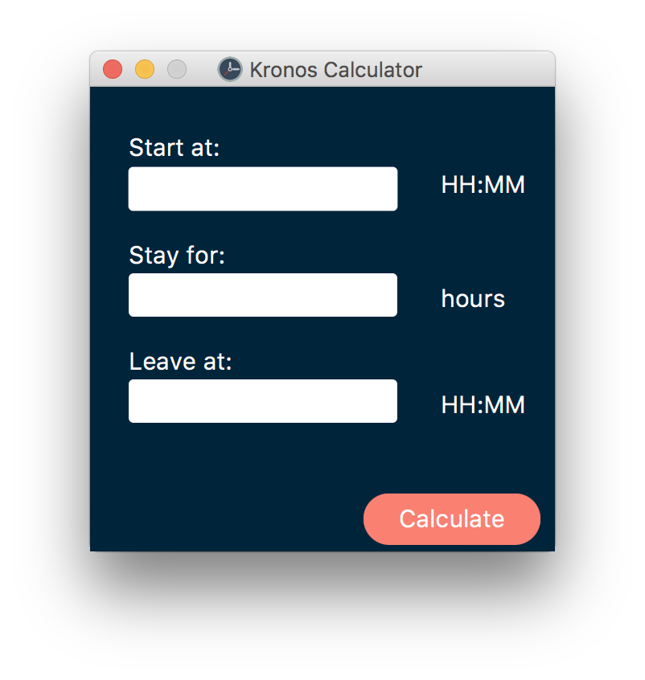

# Timesheet Calculator

JavaFX Application that calculates billable hours (unpaid 30 minute lunch), starting time, or leaving time. The user interface provides three empty fields from which two are mandatory. It calculates the result for the third field using the given information.

## Getting Started

Clone the repository in your local machine:

`$ git clone git@github.com:lauraguevara97/Timesheet-Calculator.git`

## Prerequisites

### JRE 1.8 

Install JRE 1.8 or higher [here](http://www.java.com/download)

After this step we can assume that all the libraries required by the program will be installed in your local machine.

## Running The Program

### JAR File

The JAR file is located [here](timesheet_calculator.jar)

To run the file from the Terminal use:

`$ java -jar timesheet_calculator.jar `

### Using IDE

Requires installation of JDK 1.8

Steps to import project into [IntelliJ](https://www.jetbrains.com/idea/download/):
1. Open IntelliJ and select 'Import project'
2. Go to Timesheet-Calculator directory
3. Select 1.8 JDK

## GUI Example

## Version Control

GitHub was used to track all modifications and new implementations. For the full history, see the [commits on this repository](https://github.com/lauraguevara97/Timesheet-Calculator/commits/master).

## Authors

* Laura Guevara

## License

This project is licensed under the MIT License. See the [LICENSE](LICENSE.md) file for details.
